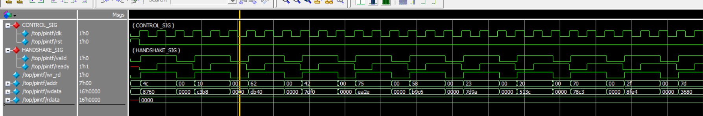

# APB-Based Memory Verification

The **Advanced Peripheral Bus (APB)** is a low-power, low-complexity bus protocol from the ARM AMBA family, designed for accessing slow-speed peripherals and memory-mapped registers. It is a synchronous, non-pipelined protocol operating typically between a few MHz to ~200 MHz, with data widths of 8, 16, or 32 bits — making it ideal for simple peripheral integration.

---

## Pin Description

| Signal  | Description                                                                 | Width  |
|---------|-----------------------------------------------------------------------------|--------|
| `clk`   | Clock signal. All operations are synchronous to the rising edge.            | 1-bit  |
| `rst`   | Active-high synchronous reset.                                              | 1-bit  |
| `valid` | Driven by master. Acts as PSEL + PENABLE combined. Initiates a transfer.   | 1-bit  |
| `ready` | Driven by slave (design). Goes high when slave is ready to complete transfer.| 1-bit  |
| `wr_rd` | Transfer direction. `1` = Write, `0` = Read.                               | 1-bit  |
| `addr`  | Address bus. Selects the target memory location.                            | 7-bit  |
| `wdata` | Write data bus. Driven by master during write transfers.                    | 16-bit |
| `rdata` | Read data bus. Driven by slave during read transfers.                       | 16-bit |

---

## APB State Diagram

<!-- Insert APB state diagram image here -->
> 📌 _State diagram to be added._

---
## FSM State Description

| State    | Condition                  | Action                                              |
|----------|----------------------------|-----------------------------------------------------|
| `IDLE`   | `valid == 0`               | No transfer. Memory idle.                           |
| `SETUP`  | `valid == 1`, `ready == 0` | `addr`, `wdata`, `wr_rd` set up by master.          |
| `ACCESS` | `valid == 1`, `ready == 1` | Transfer completes. Write to mem or `rdata` latched. Returns to IDLE. |

> **Note:** `ready` is driven combinationally — it goes high on the **same posedge** that `valid` is sampled. This results in a **0 wait-state** APB model.

## Simulation Waveform

<!-- -->

---

